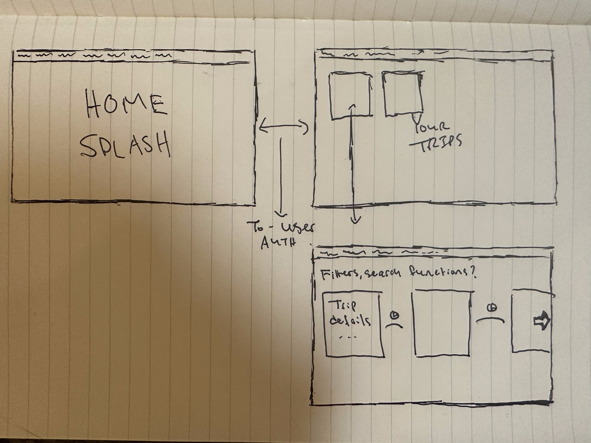
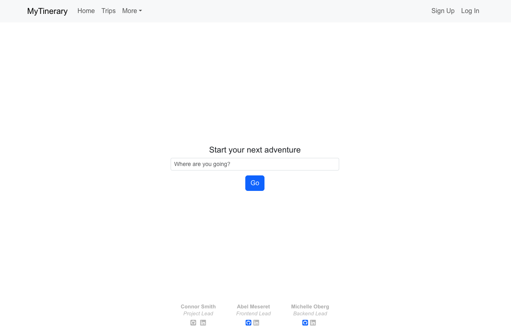
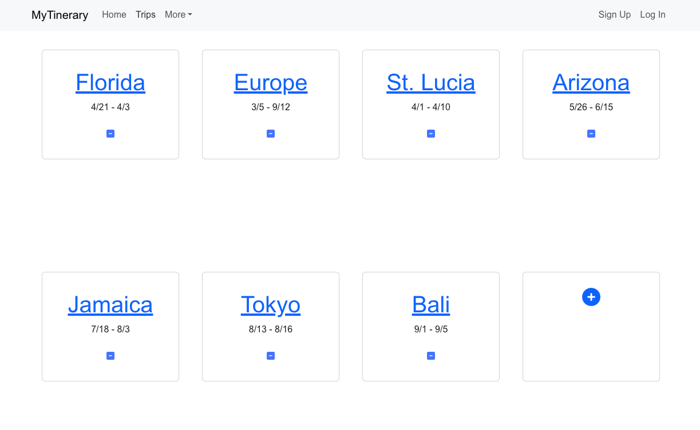
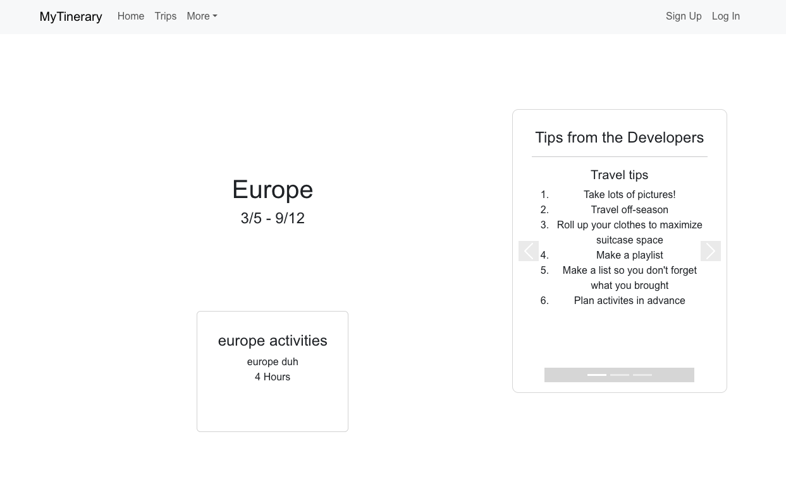

# MyTinerary App
[LINK](https://main--guileless-croissant-5353c7.netlify.app/)

## Description
Welcome to your one-stop site for planning upcoming vacations! Here you can create new trips, plan them out with activities, and we've included helpful travel tips from the developers! 

## Wireframes/Planning
See our planning boards here!
[LINK](https://app.asana.com/0/1207883440205517/1207883389651407)
[LINK](https://trello.com/invite/b/66a0416e92394d41d5382fe8/ATTId7df8f4e16ce16f8c493541e18c154148EF28CA2/project-3)

## User Stories
* As a user I can add new trip items
* As a user I can edit/delete trips
* As a user I can add activities to each trip item to organize my trip itinerary

## Walkthrough
### Home Page

### Trips Page

### Trip Show Page

## Technologies Used
* React + Vite
* React-Bootstrap
* JavaScript
* CSS

## Meet the devs!
Connor Smith - Scrum Lead
Abel Meseret - Front-End Lead
Michelle Oberg - Back-End Lead

## Directions for devs
* Clone this repository
* Install dependencies with npm install

## Future Features
* Ability to sort the activities based on location, time, etc
* Starting your adventure by viewing trending trips or activities based on search results
* Connect with friends/travelers through the app
* Add people to a group itinerary
* Implement Maps API for real time estimates between destinations or activities
* "About the Developers" landing page with info about us!